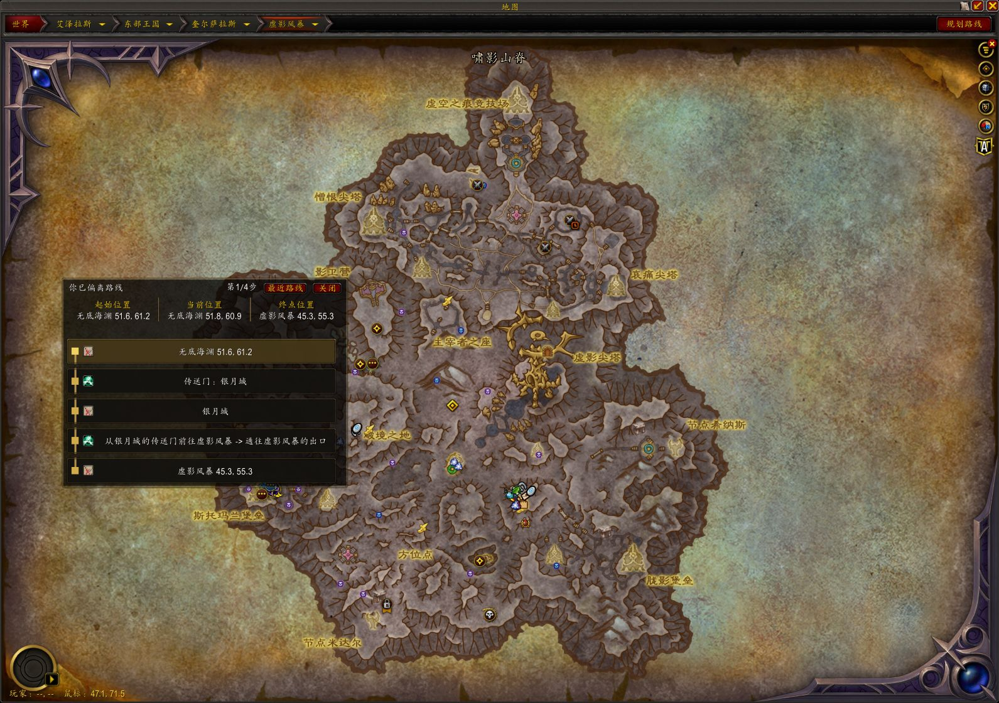
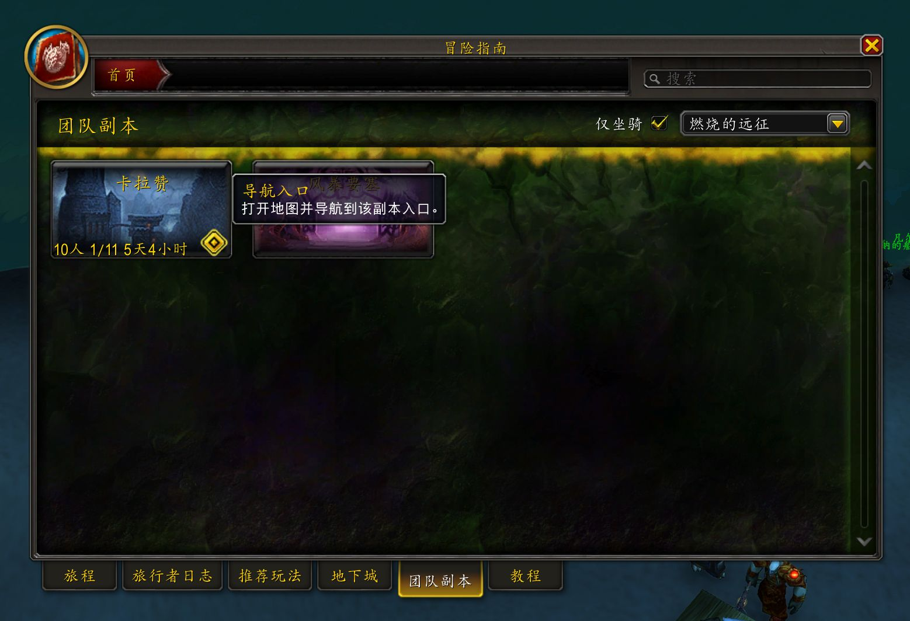

# AzerothCompanion - 艾泽拉斯助手

当前版本 / Current version: 0.1.4

## 中文说明

`AzerothCompanion`（艾泽拉斯助手）是面向魔兽世界正式服（Retail）的界面辅助插件，聚焦界面辅助、冒险手册增强、地图线路导航和实验性任务浏览。

### 功能列表

#### 入口与设置

- 系统设置中提供“艾泽拉斯助手”插件类目，包含“界面”“地图”“聊天”“任务（实验性）”“冒险手册”“关于”等页面。
- ESC 游戏菜单可直接打开同一设置页。
- 小地图按钮可快速打开设置，并通过悬停菜单进入地图、任务和冒险手册等常用功能。
- `/azerothcompanion` 可在聊天框中打开设置界面。
- 设置界面支持简体中文与英文。

#### 界面辅助

- 支持拖动插件自建窗口与已接入的暴雪顶层窗口。
- 窗口拖动支持标题栏命中模式，并可按需允许战斗中拖动。
- 世界地图支持专用拖动与右下角改大小手柄。
- Tooltip 支持游戏默认、贴近鼠标和跟随鼠标三种位置模式。
- 聊天框加载提示与插件消息使用统一前缀和颜色口径。

#### 小地图与快捷入口

- 小地图按钮支持拖动调整位置。
- 悬停菜单可按设置选择显示地图、任务和冒险手册入口。
- 冒险手册入口 tooltip 可显示当前角色副本锁定摘要。

#### 冒险手册增强

- 副本列表通过“掉落筛选”下拉框支持坐骑 / 宠物 / 图纸 / 住宅装饰类型多选，并可按已获取 / 未获取状态过滤。
- 副本列表可显示当前角色副本锁定、重置时间和团队副本进度。
- 副本列表图钉可打开入口地图并设置系统 waypoint。
- 冒险指南详情页可显示当前难度重置状态，并可在“所有栏位”下拉中按坐骑 / 宠物 / 图纸 / 住宅装饰临时过滤当前战利品列表。
- 小地图悬停菜单与右下角冒险指南按钮 tooltip 可显示当前角色副本锁定摘要。

#### 地图线路导航

- 世界地图提供“规划路线”入口。
- 导航会按当前角色阵营、已开航点、已学法术冷却状态和炉石绑定点过滤可用路径；法师幽暗城 / 奥格瑞玛等职业传送与传送门路线已恢复导出可验证结构化落点。
- 当静态数据尚不能证明某些公共传送条件时，导航会把结果降级为参考路线或提示暂无可靠路线，避免把不确定路径当作确定路线。
- 路线结果通过顶部路径 UI 展示起点、步骤和终点。
- 当前运行时支持本地步行、Taxi、船 / 飞艇等公共交通、公共传送门、炉石和职业旅行技能。

#### 任务浏览（实验性）

- 任务模块目前为实验性功能，仅作为测试功能提供。
- 提供独立任务界面，可查看当前任务和最近完成任务。
- 支持按资料片和地图浏览任务线，并在同一界面展开任务列表。
- 支持任务线 / 任务搜索、任务详情弹框和返回对应地图 / 任务线。
- “任务（实验性）”设置页提供 Quest Inspector，可按 `QuestID` 查询并复制运行时任务字段。

### 功能截图

#### 地图线路导航

#### 冒险手册增强

### 安装

1. 在 GitHub Releases 下载 `AzerothCompanion-0.1.4.zip`。
2. 解压后确认目录结构为 `_retail_\Interface\AddOns\AzerothCompanion\AzerothCompanion.toc`。
3. 启动游戏，在插件列表中启用 **AzerothCompanion**。

如果插件显示“不兼容/过期”，请确认下载的是最新版本，并检查游戏客户端 Interface 版本是否匹配。

### 使用入口

- `/azerothcompanion`
- ESC 菜单 -> 艾泽拉斯助手
- 系统设置 -> 插件 -> 艾泽拉斯助手
- 小地图按钮
- 世界地图 -> 规划路线

### 兼容范围

- 客户端：World of Warcraft Retail（正式服）
- Interface：120000、120001、120007（最高支持 Retail 12.0.7）
- 不承诺兼容怀旧服客户端
- 任务浏览为实验性功能，后续可能继续调整显示范围和数据覆盖

### 许可

本项目使用 MIT License。完整文本见 [LICENSE](LICENSE)。

---

## English

`AzerothCompanion` is a World of Warcraft Retail addon focused on UI quality-of-life tools, Encounter Journal enhancements, map route planning, and experimental quest browsing.

### Features

#### Entry Points And Settings

- Adds an "AzerothCompanion" addon category in system settings, with pages for Interface, Map, Chat, Quest (Experimental), Encounter Journal, and About.
- Adds an ESC game menu entry that opens the same settings panel.
- Adds a minimap button for quick settings access and hover-menu shortcuts to map, quest, and Encounter Journal features.
- `/azerothcompanion` opens the settings panel from chat.
- The settings UI supports Simplified Chinese and English.

#### UI Quality Of Life

- Supports moving addon-owned windows and supported Blizzard top-level windows.
- Window movement supports title-bar hit testing and optional movement while in combat.
- The world map has dedicated movement support and a lower-right resize handle.
- Tooltips support default placement, near-cursor placement, and cursor-following placement.
- Load messages and addon chat output use a unified prefix and color style.

#### Minimap And Shortcuts

- The minimap button can be dragged to adjust its position.
- Its hover menu can show map, quest, and Encounter Journal shortcuts according to settings.
- Encounter Journal shortcut tooltips can show the current character's instance lockout summary.

#### Encounter Journal Enhancements

- The instance list "Drop Filter" dropdown supports multi-select filtering for mounts, pets, recipes, and housing decorations, plus collected / uncollected states.
- The instance list can show the current character's lockout, reset time, and raid progress.
- Instance list pins can open the entrance map and set a system waypoint.
- Encounter Journal detail pages can show current-difficulty reset status and temporarily filter current loot by mount, pet, recipe, and housing decoration types.
- The minimap hover menu and lower-right Encounter Journal button tooltip can show the current character's lockout summary.

#### Map Route Planning

- The world map provides a "Plan Route" entry point.
- Routing filters paths by the current character's faction, opened taxi nodes, learned spells, spell cooldown state, and hearthstone bind point; verified structured landing points for mage Undercity / Orgrimmar teleports and portals are available again.
- When static data cannot prove some public transport conditions, routing downgrades the result to a reference route or reports that no reliable route is currently available.
- Route results show the start, steps, and destination in the top route UI.
- Current runtime routing supports local walking, taxi, boats / zeppelins and other public transport, public portals, hearthstone, and class travel abilities.

#### Quest Browsing (Experimental)

- The quest module is experimental and provided as a test feature.
- Provides a standalone quest UI for current quests and recently completed quests.
- Supports browsing questlines by expansion and map, with expandable quest lists in the same panel.
- Supports questline / quest search, quest detail popups, and returning to the related map or questline.
- The "Quest (Experimental)" settings page provides Quest Inspector for querying and copying runtime quest fields by `QuestID`.

### Screenshots

#### Map Route Planning

#### Encounter Journal Enhancements

### Installation

1. Download `AzerothCompanion-0.1.4.zip` from GitHub Releases.
2. Extract it and confirm the directory structure is `_retail_\Interface\AddOns\AzerothCompanion\AzerothCompanion.toc`.
3. Start the game and enable **AzerothCompanion** in the addon list.

If the addon appears incompatible or out of date, download the latest version and check whether your game client's Interface version is supported.

### Usage

- `/azerothcompanion`
- ESC menu -> AzerothCompanion
- System Settings -> AddOns -> AzerothCompanion
- Minimap button
- World map -> Plan Route

### Compatibility

- Client: World of Warcraft Retail
- Interface: 120000, 120001, 120007 (up to Retail 12.0.7)
- Classic clients are not supported
- Quest browsing is experimental and may continue to change in coverage and presentation

### License

This project uses the MIT License. See [LICENSE](LICENSE) for the full text.
